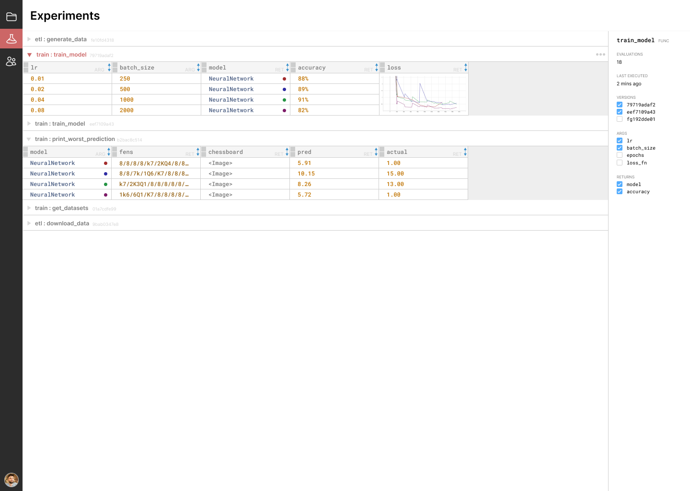

# HitSave: Effortless data.

## Contents

```{eval-rst}
.. toctree::
   :maxdepth: 1
   :caption: Guides

   guides/installation
   guides/getting_started
   guides/files

.. toctree::
   :maxdepth: 1
   :caption: Tutorials

   tutorials/balloons

.. toctree::
   :maxdepth: 1
   :caption: API reference

   module/decorators
```

## Introduction to HitSave

HitSave provides a powerfully simple system for managing data in your Python 
workflows. 

Using memoization (both locally and in the cloud) HitSave allows you 
to granularly version your code _and_ data. This saves your team valuable developer
and compute resources, as well as giving you experiment management out of the box
with no additional work.

HitSave is currently in beta. We're working towards delivering a roadmap 
of exciting features, culminating in full execution orchestration for large, 
computationally-intensive projects. For now, HitSave offers the following early 
feature set.

## Features

### Cloud memoization

HitSave's core mechanic is simple: memoized functions. HitSave provides the [`@memo`](hitsave.memo)
decorator, which you can think of as a more powerful version of [`@lru_cache`](https://docs.python.org/3/library/functools.html#functools.lru_cache).

HitSave can be configured to cache your function executions to the cloud. Read the
[getting started guide](/guides/getting_started.md) for more information.

### Granular code versioning

HitSave uses a cache invalidation algorithm that caches both your code and your
data. This algorithm traverses the full tree of code dependencies to ensure 
soundness. So if your code changes, the cache invalidates. 

### Experiment management

If you mark a function as [`@experiment`](hitsave.experiment), this flags that the memoized function 
should be displayed in your dashboard. You'll be able to see visualized artifacts 
right in the browser window. We've been using HitSave to manage experiments for a 
machine learning project where we're attempting to make a neural network understand 
chess endgames. Here's what the dashboard looks like:


